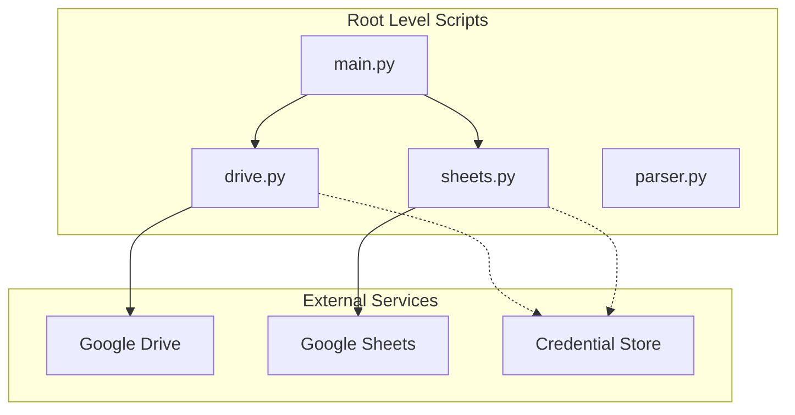

# Authentication and Authorization DOMAIN - Current implementation status and service-auth boundary review

## Overview

The repository manifest lists **0 dedicated files** for Authentication and Authorization, so this domain is **not represented as a first-class feature** in the current project layout. There are no documented auth classes, middleware, handlers, or domain services available from the provided source context.

The only plausible auth boundary in this repository is at the root integration layer, where `drive.py` and `sheets.py` would be the natural places for Google service credentials or delegated access logic if such behavior exists. `main.py` is the only plausible coordinator for authenticated operations, but no verifiable implementation details are available here.

## Architecture Overview

## Current Implementation Status

| Area | Status | Evidence |
| --- | --- | --- |
| Dedicated Authentication and Authorization files | Absent | Manifest lists **0** dedicated files |
| First-class auth domain | Not present | No auth-specific module is identified in the repository layout |
| Token acquisition flow | Not verifiable | No inspectable auth implementation is available in the provided source context |
| OAuth flow | Not verifiable | No inspectable auth implementation is available in the provided source context |
| Service-account usage | Not verifiable | No inspectable auth implementation is available in the provided source context |
| Permission scopes | Not verifiable | No inspectable auth implementation is available in the provided source context |
| Credential storage | Not verifiable | No inspectable auth implementation is available in the provided source context |
| Access-control decisions | Not verifiable | No inspectable auth implementation is available in the provided source context |
| Auth coordination in `main.py` | Not verifiable | No inspectable orchestration code is available in the provided source context |

## Service-Auth Boundary Review

### `drive.py`

The current repository layout does not surface a standalone Authentication and Authorization module. Any auth behavior, if present, would be embedded at the service-integration boundary rather than modeled as its own domain.

*Root-level integration boundary for Google Drive usage*

| Review Item | Status |
| --- | --- |
| Token acquisition | Not verifiable |
| OAuth usage | Not verifiable |
| Service account usage | Not verifiable |
| Scope definition | Not verifiable |
| Credential storage | Not verifiable |
| Access-control decisions | Not verifiable |

`drive.py` is the most likely boundary where Google Drive credentials or delegated access would be applied if the repository embeds infrastructure-level auth. No source code is available here to confirm how the service is initialized, how credentials are loaded, or whether the script enforces any access restrictions before Drive operations.

### `sheets.py`

*Root-level integration boundary for Google Sheets usage*

| Review Item | Status |
| --- | --- |
| Token acquisition | Not verifiable |
| OAuth usage | Not verifiable |
| Service account usage | Not verifiable |
| Scope definition | Not verifiable |
| Credential storage | Not verifiable |
| Access-control decisions | Not verifiable |

`sheets.py` is the corresponding boundary for Google Sheets access. If authentication is embedded in the repository, this file would be expected to carry the service credential wiring and scope handling, but no implementation evidence is available in the provided source context.

### `main.py`

*Root orchestration entry point*

| Review Item | Status |
| --- | --- |
| Auth initiation | Not verifiable |
| Auth coordination | Not verifiable |
| Permission gating | Not verifiable |
| Service call sequencing | Not verifiable |

`main.py` is the only root-level candidate for coordinating authenticated actions across the repository’s service scripts. No verifiable execution path is available here to show whether it gates downstream calls based on credentials, refreshes tokens, or routes authenticated work through `drive.py` and `sheets.py`.

## Authentication Boundary Findings

| Finding | Status |
| --- | --- |
| Authentication modeled as a separate domain | No |
| Authentication embedded in root scripts | Unverified from source context |
| End-user login/session handling | Not present in the manifest |
| External service credentials likely required | Yes, for Google Drive / Google Sheets integration boundaries |
| Verified implementation details for credentials or scopes | No |

## Integration Points

- `drive.py` as the Drive service boundary
- `sheets.py` as the Sheets service boundary
- `main.py` as the possible orchestration entry point
- External Google services as the likely authorization target

## Error Handling

No authentication-specific error handling could be verified from the provided source context. There are no inspectable auth classes, exception paths, retry branches, or credential-failure branches available for documentation.

## Caching Strategy

No authentication caching or token caching strategy could be verified from the provided source context.

## Dependencies

- Google Drive integration boundary: `drive.py`
- Google Sheets integration boundary: `sheets.py`
- Root orchestration: `main.py`
- External credential material, if present, would be infrastructure-level rather than a dedicated auth domain asset

## Testing Considerations

- Verify whether `drive.py` loads credentials from environment, file, or secret manager
- Verify whether `sheets.py` uses OAuth or a service account
- Verify whether `main.py` coordinates any authenticated initialization before invoking service operations
- Verify required scopes for Drive and Sheets access
- Verify that credential failure paths are handled consistently across the root scripts

## Key Classes Reference

| Class | Responsibility |
| --- | --- |
| None identified | The manifest does not list any dedicated Authentication and Authorization classes or modules. |
