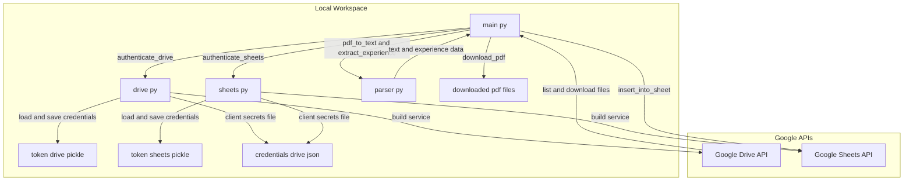
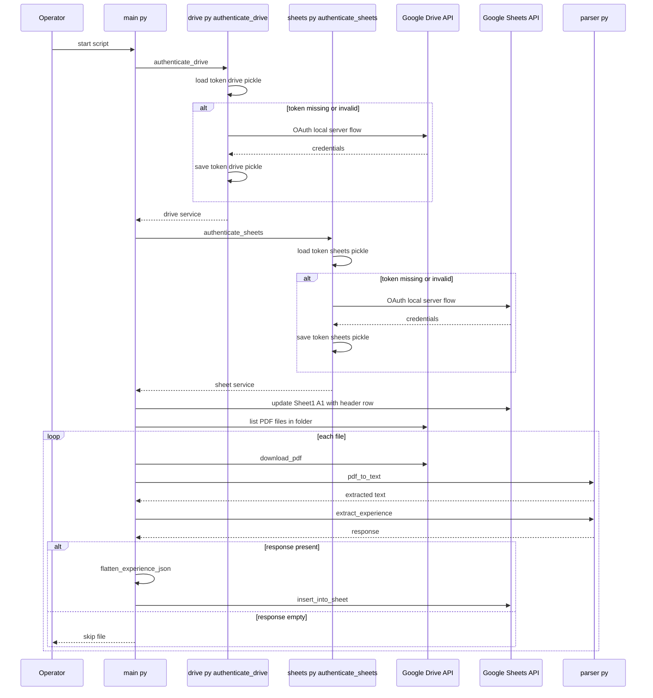

# Configuration, Credentials, and Runtime Operations

## Overview

This workflow is a local Python automation script that reads PDF files from a Google Drive folder, extracts text and experience data, and writes the result into a Google Sheet. The orchestration happens in `main.py`, while `drive.py` and `sheets.py` handle OAuth authentication and service construction for Google Drive and Google Sheets.

The runtime is built around file-based secrets and persisted OAuth tokens. On first run, both auth helpers open a local browser flow with `InstalledAppFlow.run_local_server(port=0)`, then store the resulting credentials in `token_drive.pickle` and `token_sheets.pickle` for reuse on later runs. The script also relies on hardcoded Drive folder and Sheet identifiers inside `main.py` when executed as a standalone program.

## Runtime Architecture



## Configuration Surface

### `main.py`

The first execution is interactive: both Google auth helpers start a local OAuth server and expect a browser-based sign-in before the workflow can continue.

*`main.py`*

`main.py` is the runtime entry point. It embeds the workflow constants, writes the sheet header, iterates Drive files, and coordinates parsing and insertion.

| Constant / Value | Type | Purpose |
| --- | --- | --- |
| `HEADER` | `list[str]` | Column header row written to `Sheet1!A1` before any file processing starts |
| `FOLDER_ID` | `str` | Default Google Drive folder identifier used when the script is run directly |
| `SHEET_ID` | `str` | Default Google Sheet identifier used when the script is run directly |
| `range="Sheet1!A1"` | `str` | Target cell range for the header write |


### `drive.py`

*`drive.py`*

`drive.py` defines the Drive authentication boundary and the scope used to request access.

| Constant / Value | Type | Purpose |
| --- | --- | --- |
| `SCOPES` | `list[str]` | OAuth scope list for read-only Drive access |
| `credentials_drive.json` | file | Client secrets file consumed by `InstalledAppFlow.from_client_secrets_file` |
| `token_drive.pickle` | file | Persisted Drive OAuth token cache |
| `port=0` | `int` | Uses an ephemeral local port for the browser auth callback |


### `sheets.py`

*`sheets.py`*

`sheets.py` defines the Sheets authentication boundary and the scope used to request spreadsheet access.

| Constant / Value | Type | Purpose |
| --- | --- | --- |
| `SCOPES_SHEETS` | `list[str]` | OAuth scope list for spreadsheet read/write access |
| `credentials_drive.json` | file | Client secrets file reused for the Sheets auth flow |
| `token_sheets.pickle` | file | Persisted Sheets OAuth token cache |
| `port=0` | `int` | Uses an ephemeral local port for the browser auth callback |


## Credentials and Token Files

### OAuth client secrets

Both auth helpers read the same local client secrets file:

- `credentials_drive.json`- Used by `authenticate_drive()`
- Used by `authenticate_sheets()`

This means the repository expects the OAuth client configuration to be available in the working directory before the script starts.

### Persisted token caches

The auth helpers persist authorized credentials separately per service:

- `token_drive.pickle`
- `token_sheets.pickle`

The code loads each token file first, reuses it when valid, and only triggers browser-based OAuth when the cached credential is missing or invalid.

## External API Scopes

| Helper | Scope string | Google API | Runtime effect |
| --- | --- | --- | --- |
| `authenticate_drive()` |  | Google Drive v3 | Grants read-only access used for folder listing and PDF download |
| `authenticate_sheets()` | `https://www.googleapis.com/auth/spreadsheets` | Google Sheets v4 | Grants spreadsheet write access used for header and row insertion |


## Execution Flow

### Startup and authentication

1. `main(folder_id, sheet_id)` starts by calling `authenticate_drive()` and `authenticate_sheets()`.
2. Each auth helper attempts to load its own pickle token from the local working directory.
3. If the cached token is missing or invalid, `InstalledAppFlow.from_client_secrets_file('credentials_drive.json', scope)` is used.
4. The flow opens a local browser server with `run_local_server(port=0)`.
5. A refreshed credential is written back to the corresponding pickle file.
6. The authenticated Google API client is built with `build('drive', 'v3', credentials=creds)` or `build('sheets', 'v4', credentials=creds)`.

### Spreadsheet initialization

1. `main.py` writes the `HEADER` array to `Sheet1!A1`.
2. The update is sent through `sheet_service.spreadsheets().values().update(...)`.
3. The script performs this write before processing any PDFs.

### PDF processing loop

1. `list_pdfs_from_folder(drive_service, folder_id)` returns the Drive files to process.
2. For each file:- The script prints `📄 Processing ...`
- `download_pdf(drive_service, file['id'], pdf_path)` saves the PDF locally as `./<file name>`
- `pdf_to_text(pdf_path)` converts the PDF to text
- `extract_experience(text)` extracts structured experience data
3. If the response is falsey, the file is skipped with a console warning.
4. If parsing succeeds, the script attempts to flatten the response and insert the row into the sheet with `insert_into_sheet(sheet_service, sheet_id, row)`.

### Sequence diagram



## Module and Function Reference

### `main.py`

*`main.py`*

| Function | Description |
| --- | --- |
| `main` | Orchestrates Drive auth, Sheets auth, header initialization, file enumeration, PDF download, parsing, flattening, and sheet insertion |


### `drive.py`

*`drive.py`*

| Function | Description |
| --- | --- |
| `authenticate_drive` | Loads or refreshes Drive credentials from local files and returns a Drive v3 client |


### `sheets.py`

*`sheets.py`*

| Function | Description |
| --- | --- |
| `authenticate_sheets` | Loads or refreshes Sheets credentials from local files and returns a Sheets v4 client |


### `parser.py`

*`parser.py`*

| Function | Description |
| --- | --- |
| `pdf_to_text` | Converts a downloaded PDF file into text for downstream extraction |
| `extract_experience` | Processes extracted text and returns structured experience data |


### Runtime helper functions used by `main.py`

| Function | Observed role in workflow |
| --- | --- |
| `list_pdfs_from_folder` | Produces the file list iterated by the main processing loop |
| `download_pdf` | Saves each Drive file locally before parsing |
| `insert_into_sheet` | Writes the processed row into the spreadsheet |
| `flatten_experience_json` | Converts extracted experience data into the row format used for insertion |


## Error Handling

main.py calls flatten_experience_json(response) before insertion, but the provided imports only bring in pdf_to_text and extract_experience from parser, and no definition for flatten_experience_json appears in the shown source. In the code as shown, that call is an unresolved runtime dependency.

The runtime handling is explicit and minimal:

- If `extract_experience(text)` returns a falsey value, the file is skipped and the script prints:- `⚠️ Skipping <file> due to empty or invalid LLaMA response.`
- Any exception raised while flattening or inserting a row is caught by a broad `except Exception as e` block and printed as:- `❌ Error parsing or inserting data: ...`
- Authentication failure or expired token state is handled by rerunning the local OAuth flow and rewriting the token pickle.

This makes the workflow tolerant of bad PDFs or extraction failures, while keeping the main loop alive for subsequent files.

## Filesystem Expectations

| Path / Pattern | Purpose | Runtime behavior |
| --- | --- | --- |
| `credentials_drive.json` | OAuth client secrets | Must be available in the current working directory for both auth flows |
| `token_drive.pickle` | Drive token cache | Read first, then rewritten when auth is refreshed |
| `token_sheets.pickle` | Sheets token cache | Read first, then rewritten when auth is refreshed |
| `./<file name>` | Download target | Each PDF is saved locally using the original Drive file name |


The script writes downloaded PDFs into the current working directory using the Drive file name directly. That means the host directory must be writable, and file-name collisions will target the same local path.

## Deployment Assumptions

- The workflow is designed for an operator-running-local host, not a headless service, because both OAuth helpers use `run_local_server(port=0)`.
- The same local folder must contain the OAuth client secrets file and the token cache files.
- The target spreadsheet already exists and exposes a `Sheet1` tab, because the header write targets `Sheet1!A1`.
- The Drive source folder and Spreadsheet destination are supplied as IDs, and `main.py` uses embedded defaults when started directly.

## Operational Runbook

### First-time setup

1. Place `credentials_drive.json` in the repository root or working directory.
2. Ensure the Google OAuth client represented by that file is allowed to request:- Drive read-only access
- Sheets write access
3. Verify the destination spreadsheet contains a `Sheet1` tab.
4. Make sure the Google Drive folder referenced by `FOLDER_ID` contains the PDFs to process.

### Standard run

1. Open a terminal in the project directory.
2. Run the script:

```bash
   python main.py
```

1. Complete the browser-based Google sign-in when the local auth server opens.
2. Watch the console for:- file processing messages
- skip warnings for empty extraction results
- parsing or insertion errors

### Re-run behavior

- If `token_drive.pickle` and `token_sheets.pickle` are still valid, the workflow proceeds without prompting for OAuth.
- If either token is invalid, the corresponding auth helper restarts the browser flow automatically.

## Dependencies

### Python and library dependencies

The shown code imports:

- `googleapiclient.discovery.build`
- `google_auth_oauthlib.flow.InstalledAppFlow`
- `pickle`
- `os`
- `googleapiclient.http`

### Internal module dependencies

`main.py` orchestrates the workflow through these imported functions:

- `authenticate_drive`
- `list_pdfs_from_folder`
- `download_pdf`
- `authenticate_sheets`
- `insert_into_sheet`
- `pdf_to_text`
- `extract_experience`

The runtime also depends on the spreadsheet row structure expected by the `HEADER` constant in `main.py`.

## Key Classes Reference

| Class | Responsibility |
| --- | --- |
| `main.py` | Coordinates the end-to-end folder-to-sheet workflow and embeds the default IDs and header row |
| `drive.py` | Authenticates to Google Drive and exposes the Drive service client |
| `sheets.py` | Authenticates to Google Sheets and exposes the Sheets service client |
| `parser.py` | Converts PDF content into text and extracts structured experience data |
