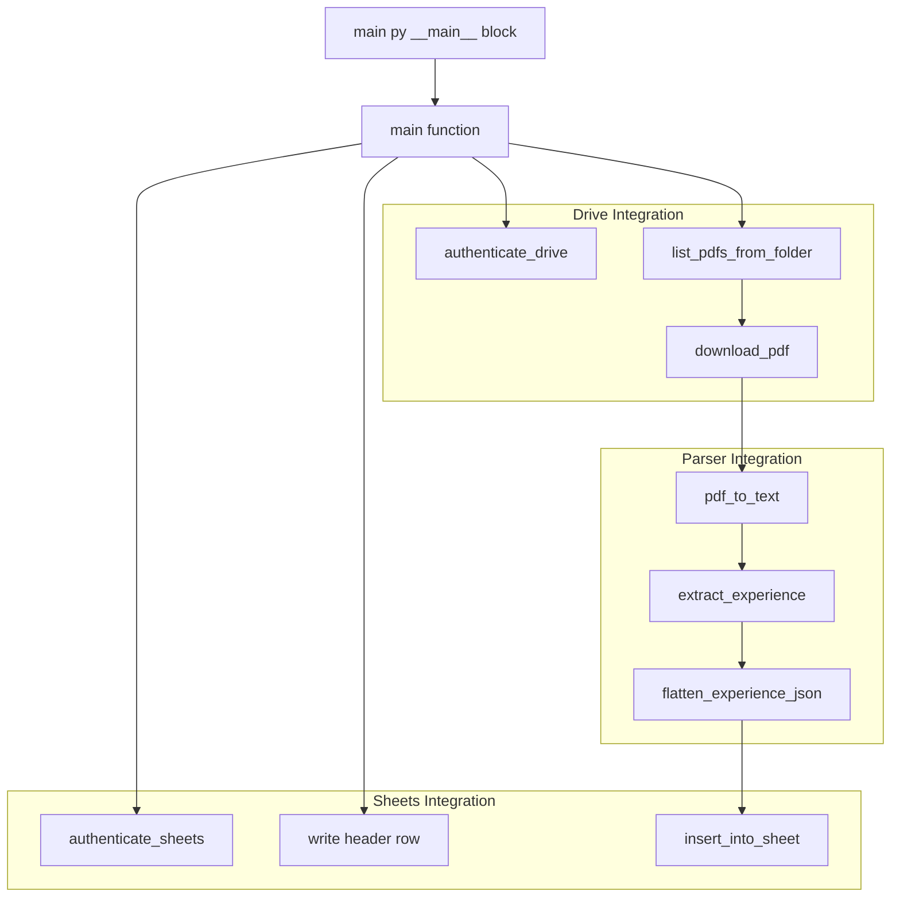
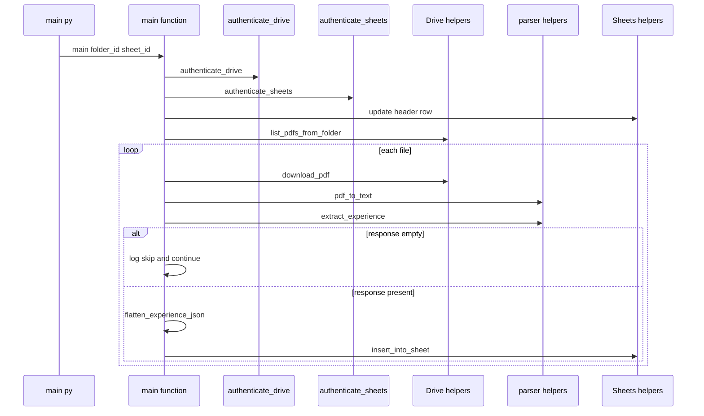
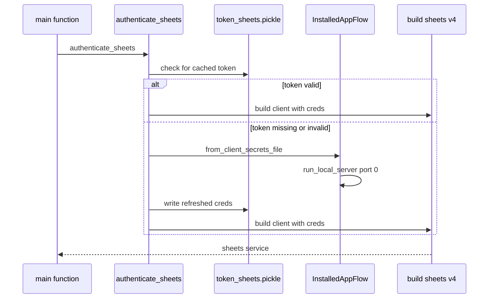

# Core Workflow Architecture

## Overview

`main.py` is the repository’s runtime orchestrator. It authenticates access to Google Drive and Google Sheets, writes a fixed header row into the target spreadsheet, enumerates PDFs from a Drive folder, downloads each file locally, converts each PDF to text, extracts structured experience data, and writes one row per processed file into Sheets.

The workflow is batch-oriented and sequential. A single invocation of `main(folder_id, sheet_id)` processes the entire returned file list in order, and the direct script entrypoint in `main.py` uses hard-coded Drive folder and spreadsheet IDs when the module is run as `__main__`.

## Architecture Overview

## Entrypoint and Startup Configuration

### `main.py`

*File: `main.py`*

`main(folder_id, sheet_id)` is the single orchestration function visible in the root workflow. The direct script path in `if __name__ == "__main__":` calls it with static IDs:

- `FOLDER_ID = "1YkLK3Ags8WzZIXcINbU6xArkBzjEHQhz"`
- `SHEET_ID = "1Nd1MqsHJV8LjHvzKXVujz2qUMqi-4OmwXZnxe-MfooE"`

The script entrypoint does not parse command-line arguments in the visible code. It starts immediately with those constants when the file is executed directly.

### Startup configuration values

| Setting | Source | Role in the workflow |
| --- | --- | --- |
| `FOLDER_ID` | `main.py` `__main__` block | Default Drive folder processed by the batch run |
| `SHEET_ID` | `main.py` `__main__` block | Default spreadsheet updated by the batch run |
| `HEADER` | `main.py` inside `main()` | Fixed header row written before file processing starts |
| `SCOPES` | `drive.py` | Drive read-only OAuth scope |
| `SCOPES_SHEETS` | `sheets.py` | Sheets OAuth scope |
| `token_sheets.pickle` | `sheets.py` | Local persisted Sheets token cache |
| `credentials_drive.json` | `sheets.py` | OAuth client secret file used for Sheets authentication |
| `Sheet1!A1` | `main.py` | Target range for the header row update |

### Header schema written to Sheets

`main()` writes a 13-column header row before any file processing begins:

| Position | Column |
| --- | --- |
| 1 | `Name` |
| 2 | `Company 1` |
| 3 | `Title 1` |
| 4 | `Start Date 1` |
| 5 | `End Date 1` |
| 6 | `Company 2` |
| 7 | `Title 2` |
| 8 | `Start Date 2` |
| 9 | `End Date 2` |
| 10 | `Company 3` |
| 11 | `Title 3` |
| 12 | `Start Date 3` |
| 13 | `End Date 3` |

## Runtime Orchestration

### Primary execution path

`main()` executes in this order:

1. `authenticate_drive()` creates the Drive service client.
2. `authenticate_sheets()` creates the Sheets service client.
3. `main()` writes the `HEADER` row to `Sheet1!A1` with `valueInputOption="RAW"`.
4. `list_pdfs_from_folder(drive_service, folder_id)` retrieves the file list.
5. Each file is processed sequentially:- log the filename
- build `pdf_path = f"./{file['name']}"`
- `download_pdf(drive_service, file['id'], pdf_path)`
- `pdf_to_text(pdf_path)`
- `extract_experience(text)`
- skip the file if the response is empty or falsy
- flatten the extracted payload
- `insert_into_sheet(sheet_service, sheet_id, row)`

The visible batch loop processes one file at a time and does not branch into parallel execution.

## Module Boundaries

### `main.py`

Note: main.py calls flatten_experience_json(response), but the visible source does not import or define that symbol. In the code as shown, a truthy parser response reaches that line and raises NameError; the inner try block catches it, logs ❌ Error parsing or inserting data:, and continues to the next file.

*File: `main.py`*

`main.py` is the coordination layer. It does not contain parsing logic or adapter logic itself; it sequences the helpers imported from `drive.py`, `parser.py`, and `sheets.py`.

| Item | Type | Responsibility |
| --- | --- | --- |
| `main` | function | Orchestrates authentication, header initialization, Drive listing, PDF download, parsing, and Sheets insertion |
| `__main__` block | script entrypoint | Launches the workflow with fixed folder and spreadsheet IDs |

Visible call-site dependencies in `main.py`:

| Imported helper | Used for |
| --- | --- |
| `authenticate_drive` | Acquire the Drive client before file enumeration and download |
| `list_pdfs_from_folder` | Retrieve files from the target Drive folder |
| `download_pdf` | Persist each PDF locally before parsing |
| `authenticate_sheets` | Acquire the Sheets client before header write and row insertion |
| `insert_into_sheet` | Write a processed row into the spreadsheet |
| `pdf_to_text` | Convert the downloaded PDF into text |
| `extract_experience` | Build the structured response consumed by row flattening |

Runtime logging visible in `main.py`:

| Condition | Log output |
| --- | --- |
| File starts processing | `📄 Processing {file['name']}...` |
| Parser response is empty | `⚠️ Skipping {file['name']} due to empty or invalid LLaMA response.` |
| Row flattening or insertion fails | `❌ Error parsing or inserting data:` |

### `drive.py`

*File: `drive.py`*

`drive.py` exposes the Drive access boundary used by `main.py`. The visible module configuration defines the OAuth scope, and the orchestration path depends on the Drive helpers to enumerate and fetch PDF content.

| Item | Type | Responsibility |
| --- | --- | --- |
| `SCOPES` | list[str] | Drive read-only OAuth scope |
| `authenticate_drive` | function | Returns the Drive client consumed by the orchestration flow |
| `list_pdfs_from_folder` | function | Produces the file collection consumed by the batch loop |
| `download_pdf` | function | Downloads a Drive PDF to the local filesystem path used by parsing |

The file imports `build`, `InstalledAppFlow`, `pickle`, `os`, and `googleapiclient.http`, which identifies the module as a Google API adapter boundary.

### `sheets.py`

*File: `sheets.py`*

`sheets.py` exposes the Sheets access boundary. The visible implementation is the credential bootstrap path for `authenticate_sheets()`.

| Item | Type | Responsibility |
| --- | --- | --- |
| `SCOPES_SHEETS` | list[str] | Sheets OAuth scope |
| `authenticate_sheets` | function | Loads cached credentials or runs OAuth, then returns a Sheets v4 client |
| `insert_into_sheet` | function | Used by `main.py` to persist each flattened row |

#### Sheets authentication lifecycle

`authenticate_sheets()` performs a local credential-cache lifecycle:

- checks whether `token_sheets.pickle` exists
- loads cached credentials with `pickle.load`
- if credentials are missing or invalid, starts an OAuth flow with `InstalledAppFlow.from_client_secrets_file('credentials_drive.json', SCOPES_SHEETS)`
- runs the local server flow with `port=0`
- writes refreshed credentials back to `token_sheets.pickle`
- returns `build('sheets', 'v4', credentials=creds)`

### `parser.py`

*File: `parser.py`*

`parser.py` is the text extraction boundary consumed by `main.py`. The visible orchestration only relies on two parser helpers.

| Item | Type | Responsibility |
| --- | --- | --- |
| `pdf_to_text` | function | Converts the local PDF file into a text payload for downstream extraction |
| `extract_experience` | function | Produces the structured response consumed by row flattening |

`main.py` treats the parser output as an intermediate response object and only checks whether it is truthy before continuing to row construction.

## Batch Execution Model

The visible root workflow is a one-pass batch job:

- one call to `main(folder_id, sheet_id)` processes one folder and one spreadsheet
- the header row is written once before any file is handled
- each Drive file is processed sequentially
- each file gets a local path derived directly from `file['name']`
- rows are written individually after parsing

### File object usage

`main.py` expects each item returned by `list_pdfs_from_folder` to provide at least:

| Field | Used for |
| --- | --- |
| `file['name']` | Logging and the local PDF filename |
| `file['id']` | Drive file identifier passed to `download_pdf` |

### Output shape implied by the header

The header layout shows the spreadsheet is organized as a fixed-width summary table:

- one identity field: `Name`
- up to three experience blocks
- each block contains `Company`, `Title`, `Start Date`, and `End Date`

That structure defines the row shape that `flatten_experience_json()` is expected to produce before `insert_into_sheet()` is called.

## Error Handling

| Stage | Visible handling | Effect on execution |
| --- | --- | --- |
| Drive authentication | Not wrapped in a local `try` in `main.py` | Any failure stops the run before file enumeration begins |
| Sheets authentication | Not wrapped in a local `try` in `main.py` | Any failure stops the run before header write begins |
| Header update | Not wrapped in a local `try` in `main.py` | Any failure stops the run before folder processing begins |
| File listing | Not wrapped in a local `try` in `main.py` | Any failure stops the batch before the loop starts |
| PDF download | Not wrapped in a local `try` in `main.py` | Any failure aborts the current run |
| PDF to text conversion | Not wrapped in a local `try` in `main.py` | Any failure aborts the current run |
| Experience extraction | Not wrapped in a local `try` in `main.py` | Any failure aborts the current run |
| Flattening and sheet insertion | Wrapped in `try` / `except Exception as e` | Errors are logged and the loop continues with the next file |
| Empty parser response | Explicit `continue` | File is skipped without attempting flattening or insertion |

The only per-file recovery path in the visible code is the inner `try` around flattening and insertion.

## Dependencies

### Internal repository dependencies

- `drive.py` supplies Drive authentication and file transfer helpers
- `parser.py` supplies PDF-to-text and experience extraction helpers
- `sheets.py` supplies Sheets authentication and row insertion helpers

### External packages and services

| Dependency | Visible role |
| --- | --- |
| `googleapiclient.discovery.build` | Builds the Sheets client in `sheets.py` |
| `google_auth_oauthlib.flow.InstalledAppFlow` | Runs OAuth authorization in `sheets.py` |
| `pickle` | Persists and reloads OAuth credentials |
| `os` | Checks for token cache existence |
| `googleapiclient.http` | Imported by `drive.py` as part of the Drive adapter boundary |
| Google Drive API | Source of folder file enumeration and PDF downloads |
| Google Sheets API | Sink for header and row writes |

## Key Classes Reference

| Class | Responsibility |
| --- | --- |
| `main.py` | Orchestrates the end-to-end batch workflow and script entrypoint |
| `drive.py` | Provides Drive authentication and file retrieval helpers |
| `parser.py` | Converts downloaded PDFs into extracted experience data |
| `sheets.py` | Provides Sheets authentication and spreadsheet write helpers |
