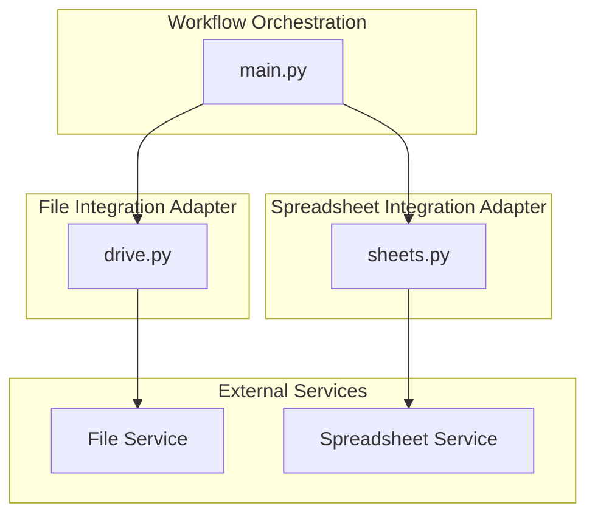
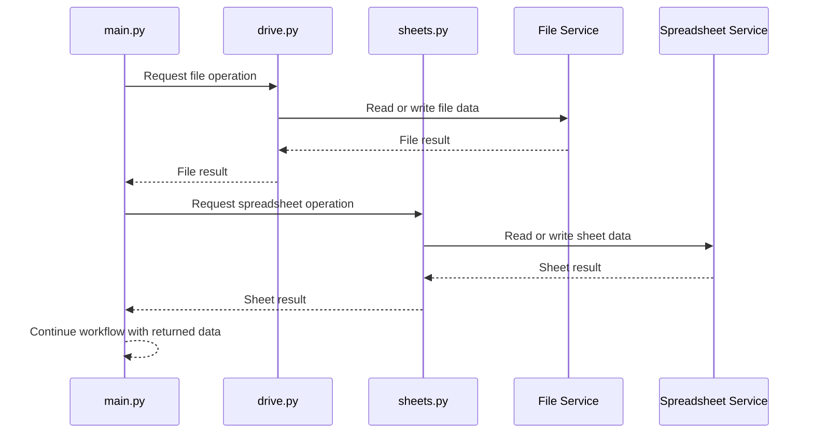
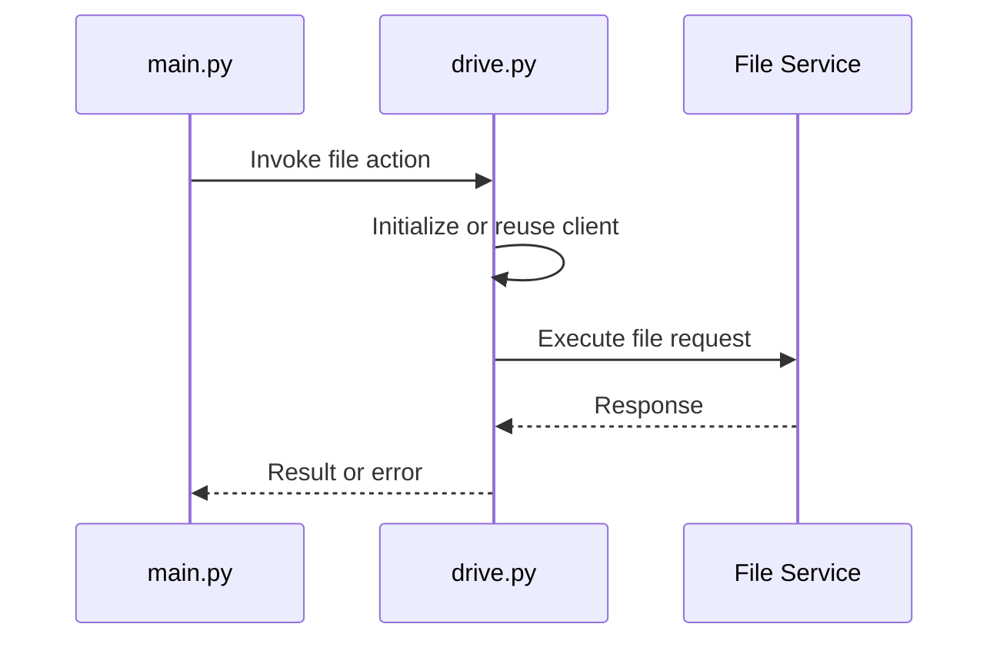
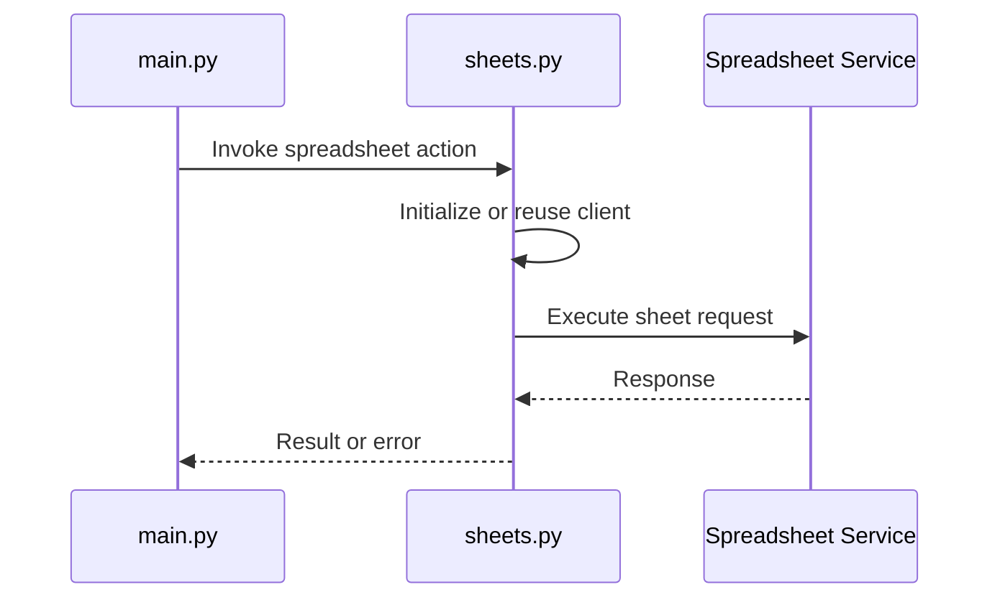

# Core Workflow Architecture - External Integration Adapters for File and Spreadsheet Operations

## Overview

This part of the workflow separates external file handling from spreadsheet operations so the top-level orchestration in `main.py` can coordinate both concerns without embedding service-specific logic directly into the entrypoint.

The repository structure indicates two distinct integration boundaries: `drive.py` for file-oriented operations and `sheets.py` for spreadsheet-oriented operations. `main.py` sits above both adapters and is responsible for sequencing, passing data between them, and deciding when each external system is invoked during the end-to-end automation flow.

## Architecture Overview

`main.py` coordinates the workflow and delegates external calls to the adapter responsible for that system boundary. `drive.py` and `sheets.py` isolate the details of their respective APIs so the orchestration layer can work with higher-level file and spreadsheet actions.

## Component Structure

### `main.py`

*File: `main.py`*

`main.py` is the workflow coordinator. It is the module that connects the automation steps to the external integration adapters, ensuring file-related work and spreadsheet-related work happen in the correct order.

#### Responsibilities

- Starts the end-to-end automation flow.
- Calls the file adapter when workflow steps require file access.
- Calls the spreadsheet adapter when workflow steps require tabular read/write operations.
- Passes data between external integrations as part of the overall process.
- Serves as the control point for adapter-level error propagation back into the workflow.

#### Adapter Interaction Model

- Uses `drive.py` for file-oriented operations.
- Uses `sheets.py` for spreadsheet-oriented operations.
- Treats both modules as service boundaries rather than embedding API details directly in the orchestration code.

#### Workflow Position

`main.py` is the only module in this section that sits above both integrations. It is the place where file retrieval, transformation handoff, and spreadsheet updates are coordinated into a single runtime path.

---

### `drive.py`

*File: `drive.py`*

`drive.py` is the file integration adapter. It represents the boundary between the workflow and the external file system or drive-backed storage layer used by the automation.

#### Responsibilities

- Initializes the client used for file operations.
- Wraps external file API calls behind local workflow-friendly functions.
- Handles file read and file write workflows.
- Uses repository credentials or service account material to authenticate file access.
- Contains adapter-specific handling for transient failures and rate-limited responses when talking to the file service.

#### Service Boundary Role

This module owns the mechanics of talking to the file service. `main.py` should not need to know transport details, credential setup details, or retry behavior when invoking file operations.

#### Read and Write Workflow

- Receives workflow intent from `main.py`.
- Builds or reuses the file client.
- Performs the required file operation.
- Returns the resulting file data, identifier, or status back to `main.py`.
- Surfaces external errors through the adapter boundary instead of forcing orchestration code to speak to the service directly.

#### Credential Usage

`drive.py` is the place where file-service credentials are expected to be consumed. The adapter boundary keeps credential handling local to file access instead of spreading secret-loading logic across the workflow.

#### Retry and Rate Limit Handling

When the external file service is throttled or temporarily unavailable, retry and backoff behavior belongs with the adapter so orchestration remains focused on process flow rather than transport recovery.

---

### `sheets.py`

*File: `sheets.py`*

`sheets.py` is the spreadsheet integration adapter. It isolates spreadsheet access from the rest of the workflow and provides the read/write boundary used by `main.py`.

#### Responsibilities

- Initializes the spreadsheet client used by the workflow.
- Wraps spreadsheet API calls behind local helper functions.
- Handles reading from and writing to spreadsheet-backed records.
- Uses repository credentials or service account material to authorize spreadsheet access.
- Contains adapter-level handling for retryable failures and rate-limit responses when interacting with the spreadsheet service.

#### Service Boundary Role

This module encapsulates spreadsheet-specific concerns such as sheet lookup, row or range operations, and write-back behavior. `main.py` interacts with it as a service boundary rather than composing raw spreadsheet calls itself.

#### Read and Write Workflow

- Receives spreadsheet work from `main.py`.
- Establishes or reuses the spreadsheet client.
- Performs the requested read or write action.
- Returns the updated spreadsheet result, record set, or operation status to the orchestration layer.
- Keeps the spreadsheet API contract localized inside the adapter.

#### Credential Usage

`sheets.py` is the place where spreadsheet authorization is expected to happen. Keeping that concern in the adapter avoids leaking authentication details into the workflow coordinator.

#### Retry and Rate Limit Handling

Retry and rate-limit recovery belong with this adapter so spreadsheet access remains resilient without requiring `main.py` to manage transport-level recovery logic.

## Runtime Interaction Model

### End-to-End Coordination Flow

`main.py` acts as the control plane for the workflow:

1. It starts the automation sequence.
2. It delegates file-oriented work to `drive.py` when file input or file output is required.
3. It delegates spreadsheet-oriented work to `sheets.py` when tabular persistence or lookup is required.
4. It uses the returned values from both adapters to continue the workflow.

### File Adapter Flow

`drive.py` handles the file side of the workflow independently from spreadsheet operations.

### Spreadsheet Adapter Flow

`sheets.py` handles the spreadsheet side of the workflow independently from file operations.

## External Integration Boundaries

### File Operations Boundary

`drive.py` owns file access concerns, including client setup, authentication, read/write calls, and service-specific fault handling. The module defines the boundary between orchestration logic and the underlying file service.

### Spreadsheet Operations Boundary

`sheets.py` owns spreadsheet access concerns, including client setup, authentication, read/write calls, and service-specific fault handling. The module defines the boundary between orchestration logic and the underlying spreadsheet service.

### Orchestration Boundary

`main.py` remains the only component responsible for sequencing both adapters in a single run. That separation keeps cross-service coordination in one place while leaving each adapter focused on one external system.

## Error Handling

The workflow boundary is split so each adapter can localize failures to its own service:

- File-specific failures are expected to originate in `drive.py`.
- Spreadsheet-specific failures are expected to originate in `sheets.py`.
- `main.py` receives those failures and decides whether the workflow can continue or must stop.

This separation keeps service recovery logic close to the external API it serves and keeps orchestration focused on control flow.

## Credential Usage

Credential handling is adapter-specific:

- `drive.py` consumes credentials needed for file access.
- `sheets.py` consumes credentials needed for spreadsheet access.

By keeping credentials inside each adapter, the workflow avoids coupling the orchestration layer to any one external authentication mechanism.

## Key Classes Reference

| Class | Responsibility |
| --- | --- |
| `main.py` | Orchestrates the workflow and delegates external work to the adapters |
| `drive.py` | Encapsulates file-service access and file read or write operations |
| `sheets.py` | Encapsulates spreadsheet-service access and sheet read or write operations |
