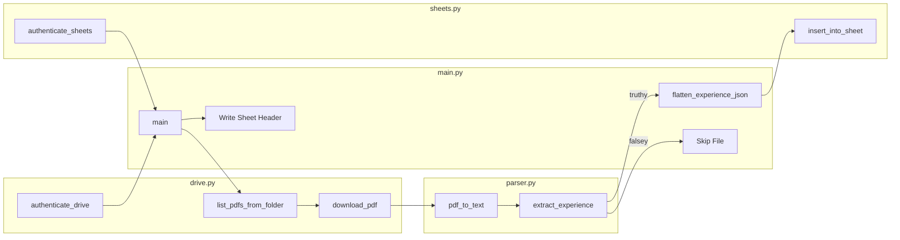
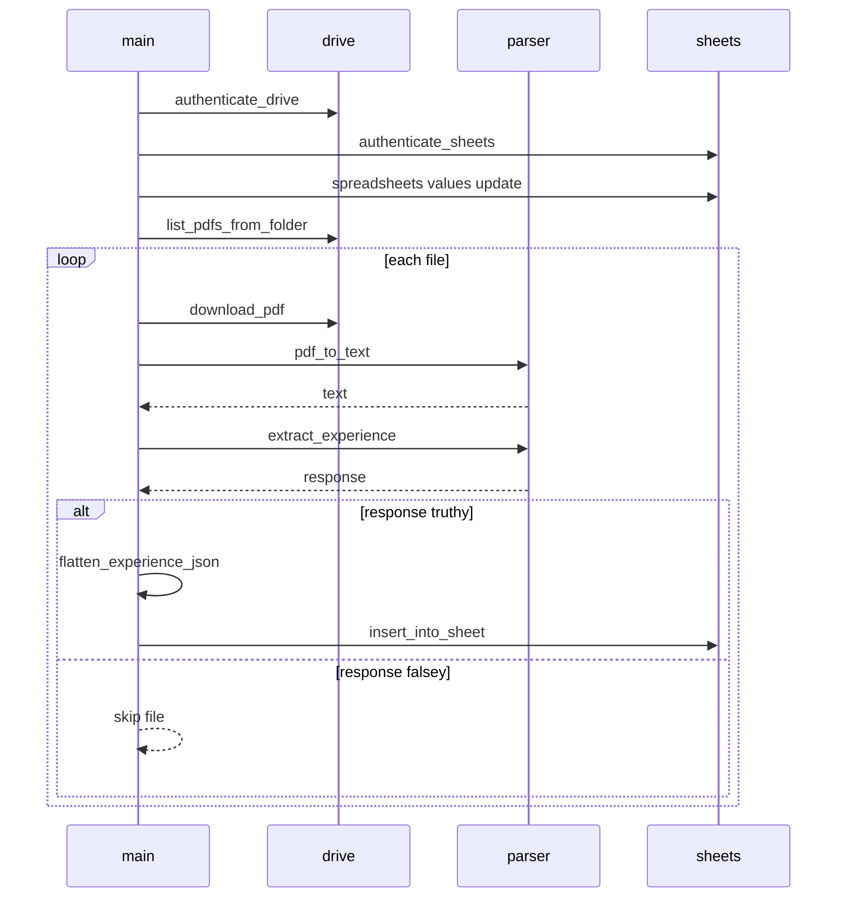

# Core Workflow Architecture - Parsing and Transformation Pipeline

## Overview

This workflow turns PDF documents into spreadsheet rows. `main.py` coordinates the full run: it authenticates Drive and Sheets, seeds the destination sheet with a fixed header row, downloads each PDF from the configured folder, and passes the local file path into `parser.py` for text extraction.

The parsing boundary is deliberately narrow in the supplied code: `parser.py` converts a PDF into a plain text string, and `main.py` performs the next transformation steps by sending that text into `extract_experience`, checking the returned value, flattening the result with `flatten_experience_json`, and inserting the final row into Sheets. That makes the pipeline split cleanly between raw document extraction and spreadsheet-ready normalization.

## Architecture Overview

## Component Structure

### `parser.py`

*parser.py*

`parser.py` is the document-to-text boundary. In the provided code, its implemented responsibility is to open a local PDF file and return the concatenated text of every page as a single newline-delimited string.

#### Module Dependencies

| Dependency | Role in visible code |
| --- | --- |
| `fitz` | Opens the PDF and reads page text in `pdf_to_text` |
| `pdfminer.high_level.extract_text` | Imported in the module |
| `requests` | Imported in the module |

#### Public Methods

| Method | Description |
| --- | --- |
| `pdf_to_text` | Opens the PDF at `file_path`, extracts text from each page, and returns one combined string. |

#### Parsing Stages

| Stage | Input | Operation | Output |
| --- | --- | --- | --- |
| Open document | `file_path` | `fitz.open(file_path)` | `doc` document handle |
| Read pages | `doc` | Iterate through `page.get_text()` for each page | Page text strings |
| Normalize text | Page text strings | `"\n".join(...)` | Single extracted text string |

#### Intermediate Structure

| Structure | Type | Purpose |
| --- | --- | --- |
| `doc` | `fitz.Document` | Holds the opened PDF for page iteration |
| `page.get_text()` output | `str` | Raw text for a single page |
| Return value | `str` | Full PDF text for downstream parsing |

#### Validation and Failure Handling

- `pdf_to_text` does not perform input validation before opening the file.
- Exceptions from `fitz.open(file_path)` or `page.get_text()` propagate to the caller.
- The function returns text only; it does not inspect layout, content quality, or semantic structure.

### `main.py`

*main.py*

`main.py` is the orchestration boundary. It connects file retrieval, PDF extraction, semantic parsing, row normalization, and spreadsheet insertion into one loop over all PDFs in the configured Drive folder.

#### Public Methods

| Method | Description |
| --- | --- |
| `main` | Authenticates Drive and Sheets, writes the sheet header, downloads each PDF, extracts text, parses the result, flattens the response, and inserts the row into Sheets. |

#### Runtime Inputs

| Input | Type | Purpose |
| --- | --- | --- |
| `folder_id` | `str` | Source Drive folder identifier |
| `sheet_id` | `str` | Destination spreadsheet identifier |

#### Script Entry Point

- When executed as a script, `main.py` calls `main(FOLDER_ID, SHEET_ID)`.
- The provided constants are hard-coded identifiers for the source folder and destination sheet.

#### Transformation Boundary

| Stage | Input | Output | Consumer |
| --- | --- | --- | --- |
| Drive listing | `folder_id` | File metadata list | `main` loop |
| Download | File metadata | Local PDF path | `pdf_to_text` |
| Text extraction | Local PDF path | Plain text string | `extract_experience` |
| Semantic parsing | Plain text string | Parsed response object | `flatten_experience_json` |
| Row normalization | Parsed response object | Sheet row data | `insert_into_sheet` |

#### Sheet Output Shape

The sheet header is written before any file processing begins. The column order is fixed in the script:

| Column Order | Header |
| --- | --- |
| 1 | `Name` |
| 2 | `Company 1` |
| 3 | `Title 1` |
| 4 | `Start Date 1` |
| 5 | `End Date 1` |
| 6 | `Company 2` |
| 7 | `Title 2` |
| 8 | `Start Date 2` |
| 9 | `End Date 2` |
| 10 | `Company 3` |
| 11 | `Title 3` |
| 12 | `Start Date 3` |
| 13 | `End Date 3` |

The header is written to `Sheet1!A1` with `valueInputOption="RAW"` before any document processing starts.

#### Workflow States

| State | Condition | Effect |
| --- | --- | --- |
| Initialization | Services authenticate successfully | Header row is written |
| File processing | Each Drive file is returned by `list_pdfs_from_folder` | PDF is downloaded and parsed |
| Skipped | `extract_experience(text)` returns a falsey value | File is not inserted into Sheets |
| Inserted | `flatten_experience_json(response)` succeeds and insertion completes | Row is written to Sheets |
| Failed | Normalization or insertion raises an exception | Error is printed and processing continues |

## Feature Flow

### PDF Ingestion and Spreadsheet Write Flow

### Transformation Sequence

The provided main.py snippet calls flatten_experience_json(response) without showing an import or definition for flatten_experience_json, and it imports extract_experience from parser.py even though the supplied parser.py snippet only defines pdf_to_text. In the shown source, those names are unresolved, so the orchestration path cannot complete as written.

1. `main` authenticates the Drive and Sheets clients.
2. `main` writes the sheet header to `Sheet1!A1`.
3. `main` lists PDFs from the configured Drive folder.
4. For each file, `main` downloads the PDF to a local path.
5. `pdf_to_text` turns the local PDF into plain text.
6. `extract_experience` consumes the raw text and returns a response object.
7. `main` skips the file if the response is falsey.
8. `flatten_experience_json` normalizes the parsed response into row data.
9. `insert_into_sheet` persists the row into the spreadsheet.

## Error Handling and Source Data Assumptions

### Error Handling

- `main.py` skips a file when `extract_experience(text)` returns a falsey value.
- `main.py` wraps row normalization and insertion in a `try`/`except Exception` block and prints the exception on failure.
- `pdf_to_text` does not trap exceptions; any file open or page-read failure bubbles up to the caller.

### Source Data Assumptions

- Each source file is assumed to be a readable local PDF when `pdf_to_text` receives its path.
- The extracted page text is assumed to be good enough for semantic parsing by `extract_experience`.
- The parsed response is assumed to be compatible with `flatten_experience_json`.
- The flattened row is assumed to match the fixed header shape written to the sheet.

### Downstream Consumption Boundaries

- `drive.py` is used only to authenticate, list PDF files, and download them before parsing begins.
- `sheets.py` is used only to authenticate the spreadsheet client and accept normalized row data after parsing.

## Dependencies

| Dependency | Role in this workflow |
| --- | --- |
| `fitz` | PDF text extraction in `pdf_to_text` |
| `drive.py` | Drive authentication and file retrieval used by `main` |
| `sheets.py` | Sheet authentication and row insertion used by `main` |
| `parser.py` | PDF-to-text extraction boundary and imported parsing functions |
| Google Drive service | Source of PDF file metadata and binary downloads |
| Google Sheets service | Destination for header writes and normalized rows |

## Key Classes Reference

| Class | Responsibility |
| --- | --- |
| `parser.py` | Extracts PDF page text and provides the raw text boundary consumed by the next parsing stage |
| `main.py` | Orchestrates Drive retrieval, parsing, normalization, and Sheets insertion |
| `drive.py` | Drive integration boundary used by `main.py` for authentication, listing, and download |
| `sheets.py` | Sheets integration boundary used by `main.py` for authentication and row insertion |
