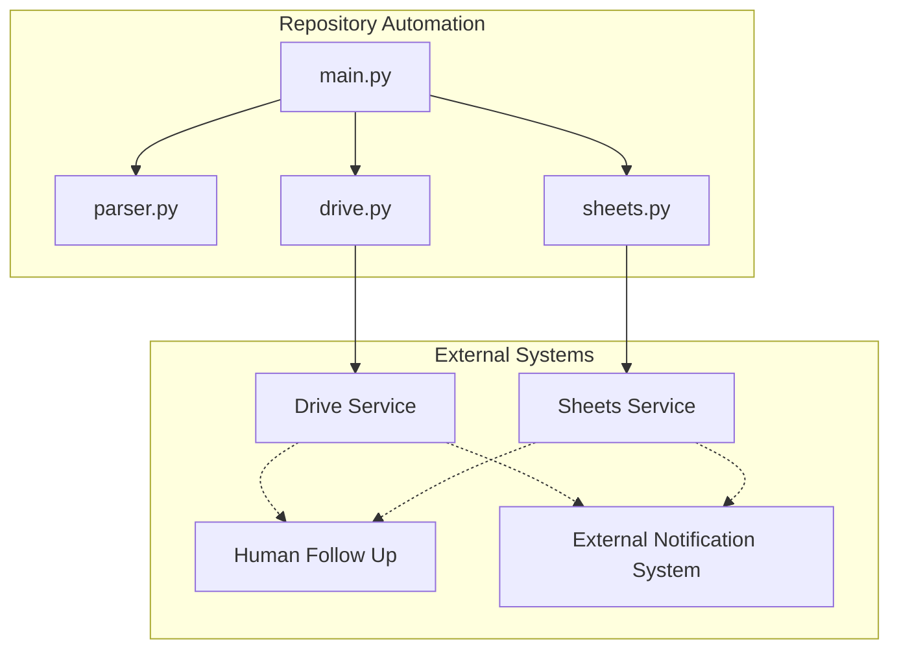
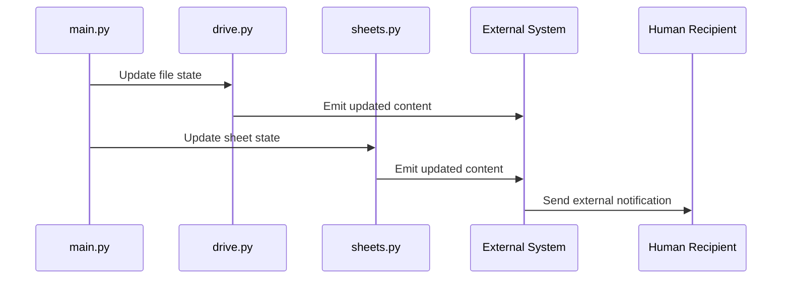

# Notifications Domain Feature Gap Analysis and Outbound Communication Check

## Overview

The repository manifest contains **0 files** for the Notifications domain, so there is no native notification subsystem to document in this section. No email, SMS, push, webhook, or in-app notification service is represented as a first-class component in the tracked project structure.

The project is centered on the root-level automation scripts `main.py`, `parser.py`, `drive.py`, and `sheets.py`. In the absence of Notifications-specific files, any outbound communication after file or sheet updates should be treated as an **integration dependency** on an external system, not as a repository-owned notification feature.

## Architecture Overview

## Feature Gap Analysis

### Native Notifications Subsystem

| Capability | Status | Evidence |
| --- | --- | --- |
| Email notifications | Absent | No Notifications files in the manifest |
| SMS notifications | Absent | No Notifications files in the manifest |
| Push notifications | Absent | No Notifications files in the manifest |
| Webhooks | Absent | No Notifications files in the manifest |
| In-app notifications | Absent | No Notifications files in the manifest |

### What the Manifest Supports

- The repository is organized around automation entrypoints and service-boundary scripts.
- `drive.py` and `sheets.py` are the only obvious candidates for update-driven workflows that could feed an external notification system.
- `main.py` is the likely orchestration entrypoint for the workflow, but there is no documented notification layer attached to it.

## Outbound Communication Check

### Direct Notification Behavior

| Check | Result |
| --- | --- |
| Email delivery implemented natively | No evidence |
| SMS delivery implemented natively | No evidence |
| Push delivery implemented natively | No evidence |
| Webhook dispatch implemented natively | No evidence |
| In-app notification center implemented natively | No evidence |

### Indirect Notification Behavior Through Automation

There is no repository-owned Notifications domain to extend, configure, or test from the manifest alone. Any alerting or human follow-up after file or sheet changes belongs to the consuming integration layer.

The only plausible outbound communication path in this repository shape is indirect:

- `main.py` orchestrates the workflow.
- `drive.py` updates or reads Drive-connected content.
- `sheets.py` updates or reads Sheets-connected content.
- Any human notification triggered after those updates would be an **external system responsibility**.

That means the repository itself should be documented as:

- **automation producer** of updated files or sheet state, not
- a **notification producer** with a native outbound channel.

### Integration Dependency Classification

If the workflow relies on a separate tool, bot, or SaaS connector to notify people after file or sheet changes, classify it as:

- **External notification integration**
- **Downstream dependency**
- **Not part of the repository Notifications domain**

## Repository Touchpoints Relevant to Notifications

### `main.py`

*`/main.py`*

- Acts as the automation orchestration boundary for the repository.
- May trigger file or sheet workflows that later require human attention.
- Does not appear in the manifest as a notification-specific implementation.

### `drive.py`

*`/drive.py`*

- Represents the Drive-side integration boundary.
- Any notification-like effect tied to Drive updates should be treated as a side effect of integration activity, not a native notification subsystem.

### `sheets.py`

*`/sheets.py`*

- Represents the Sheets-side integration boundary.
- Any post-update alerting should be attributed to downstream tooling rather than a repository-owned notification service.

### `parser.py`

*`/parser.py`*

- Supports the automation pipeline by parsing inputs or intermediate data.
- No notification responsibility is represented in the manifest.

## Feature Flows

### File or Sheet Update With External Follow Up

### Workflow Outcome

- The repository automates content updates.
- Any notification to a person occurs outside the repository boundary.
- The notification mechanism, if present, is owned by the downstream system that consumes the Drive or Sheets changes.

## Integration Dependencies

- **Google Drive or similar file service** through `drive.py`
- **Google Sheets or similar spreadsheet service** through `sheets.py`
- **External notifier or operator workflow** if human acknowledgment is required after updates
- **Orchestration entrypoint** through `main.py`

## Error Handling

No Notifications-specific handlers, retry policies, or delivery-failure recovery paths are represented in the manifest. Any error handling around alerting would have to be implemented in the external system that performs the notification, not in a native repository notification module.

## Testing Considerations

- Verify that `main.py` can complete file and sheet update flows without requiring a notification service.
- Verify that Drive and Sheets updates do not assume an in-repo notification callback.
- Verify that any human alerting dependency is configured and owned externally.
- Verify that the repository remains functional when no downstream notifier is available.

## Key Classes Reference

| Class | Responsibility |
| --- | --- |
| `main.py` | Repository automation entrypoint |
| `parser.py` | Input and intermediate data parsing boundary |
| `drive.py` | Drive integration boundary |
| `sheets.py` | Sheets integration boundary |
