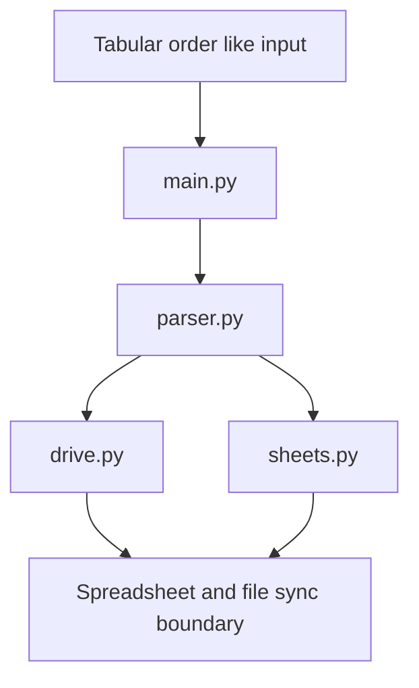

# Order Management Domain Feature Gap Analysis and Workflow Domain Verification

## Overview

The repository manifest allocates **0 files** to the Order Management domain. That makes this section a verification of absence rather than a description of an implemented order lifecycle. No order-domain services, models, state transitions, dashboards, or HTTP endpoints are present in the documented file set.

The only visible automation surface is the root-level script layer: `main.py`, `parser.py`, `drive.py`, and `sheets.py`. Those names indicate a workflow oriented around parsing and moving tabular data between storage and spreadsheet boundaries, not a transactional order-management system with ownership over fulfillment, status, or persistence.

## Verified Gap Analysis

| Capability Area | Manifest Result | Domain Impact |
| --- | --- | --- |
| Order lifecycle services | Absent | No create, update, cancel, fulfill, ship, or close workflow is documented |
| Fulfillment states | Absent | No state machine or transition model is documented |
| Status updates | Absent | No order status change service is documented |
| Storage models | Absent | No order entity, schema, or persistence model is documented |
| Operational dashboards | Absent | No monitoring or ops surface is documented |
| REST or HTTP APIs | Absent | No order-management endpoint is documented |
| Business ownership | Absent | No transactional ownership of orders is represented in the manifest |

## Architecture Overview

The Order Management manifest contains 0 files. There are no verified lifecycle services, fulfillment state machines, status update handlers, storage models, or operational dashboard artifacts for this domain. [!IMPORTANT] The visible repository boundary supports data movement and synchronization scripts, but it does not establish an Order Management domain because no lifecycle, state, or storage artifacts are present.

This architecture reflects the only visible automation boundary in the repository. It shows a script-driven flow that can move tabular records, but it does not show order-domain ownership such as fulfillment state handling, inventory commitments, payment capture, or shipment tracking.

## Component Structure

### 1. Root Automation Scripts

#### **main.py**

*`(root)/main.py`*

- Root-level entrypoint in the repository manifest.
- Serves as the visible orchestration script for the automation boundary.

**Visible responsibilities**

- Launches the script-level workflow.
- Coordinates parsing and downstream sync steps at the repository boundary.

#### **parser.py**

*`(root)/parser.py`*

- Root-level parsing script in the repository manifest.
- Represents the tabular data parsing boundary.

**Visible responsibilities**

- Handles data parsing for order-like tabular inputs.
- Produces intermediate records suitable for downstream transfer or synchronization.

#### **drive.py**

*`(root)/drive.py`*

- Root-level drive integration script in the repository manifest.
- Represents the storage or transfer boundary used by the automation flow.

**Visible responsibilities**

- Moves parsed data toward a drive-style persistence or transfer target.
- Acts as an integration boundary rather than an order-domain service.

#### **sheets.py**

*`(root)/sheets.py`*

- Root-level spreadsheet integration script in the repository manifest.
- Represents the spreadsheet synchronization boundary.

**Visible responsibilities**

- Synchronizes tabular data into or out of spreadsheet storage.
- Supports row-level data movement rather than transactional order ownership.

## Workflow-Domain Verification

The repository structure supports a simple boundary test for domain ownership:

| Verification Check | Result |
| --- | --- |
| Order lifecycle service present | No |
| Fulfillment state model present | No |
| Order status update flow present | No |
| Order persistence model present | No |
| Operational dashboard present | No |
| Spreadsheet or tabular sync script present | Yes |
| Root automation entrypoint present | Yes |

This separation matters because a script that parses rows or syncs sheets can process data that looks like orders without being an order-management system. The manifest only supports the former.

## API Integration

No HTTP or REST endpoints are documented for Order Management in the repository manifest. There are no endpoint blocks to emit for this section.

## State Management

No order-state enum, transition table, or persistence-backed workflow model is documented in the manifest. The visible automation layer is file and spreadsheet oriented, not a transactional order state machine.

## Integration Points

| Integration Boundary | Visible Role |
| --- | --- |
| `parser.py` | Tabular data parsing boundary |
| `drive.py` | Drive or file transfer boundary |
| `sheets.py` | Spreadsheet synchronization boundary |
| `main.py` | Root orchestration boundary |

## Error Handling

No order-domain error model is documented in the manifest. There are no verified business exceptions, retry policies, or compensating transaction handlers for Order Management.

## Caching Strategy

No cache keys, cache invalidation rules, or cache-backed order reads are documented in the manifest.

## Dependencies

- Root-level automation scripts: `main.py`, `parser.py`, `drive.py`, `sheets.py`
- Spreadsheet synchronization boundary
- Drive or file transfer boundary
- Tabular data parsing boundary

## Testing Considerations

- Verify that no Order Management files are introduced into the manifest.
- Verify that root scripts remain confined to parsing and synchronization boundaries.
- Verify that no order lifecycle, status, fulfillment, or dashboard artifacts appear in the domain tree.

## Key Classes Reference

| Class | Responsibility |
| --- | --- |
| `main.py` | Root automation entrypoint |
| `parser.py` | Tabular data parsing boundary |
| `drive.py` | Drive or file transfer boundary |
| `sheets.py` | Spreadsheet synchronization boundary |
