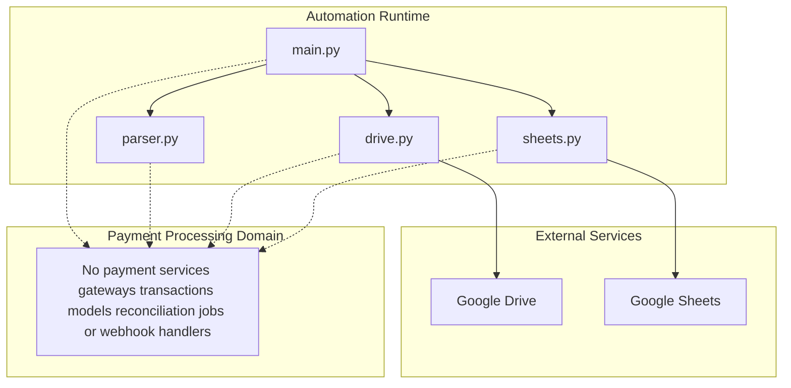

# Payment Processing Domain - Feature Gap Analysis and Financial Integration Boundary Check

## Overview

The repository manifest centers on four root-level automation scripts: `main.py`, `parser.py`, `drive.py`, and `sheets.py`. For the payment-processing domain, the manifest contains no dedicated files, so there is no implemented payment feature surface to document.

That means there is no evidence of payment capture, authorization, settlement, transaction persistence, reconciliation, or webhook-based processor callbacks. Any spreadsheet activity that touches monetary values remains on the data-handling side of the boundary and does not constitute payment processing.

## Architecture Overview

## Feature Gap Analysis

| Payment Capability | Manifest Status | Boundary Check |
| --- | --- | --- |
| Payment services | 0 files | No payment service layer exists |
| Payment gateways | 0 files | No gateway adapter or processor integration exists |
| Transaction models | 0 files | No transaction entity or record model exists |
| Capture or authorization flow | 0 files | No runtime path performs card or wallet capture |
| Settlement or payout flow | 0 files | No settlement logic exists |
| Reconciliation jobs | 0 files | No batch job or scheduled finance reconciliation exists |
| Webhook handlers | 0 files | No inbound payment notification receiver exists |
| Financial record synchronization | 0 files | No sync to a finance system or ledger is present |
| Spreadsheet financial data handling | Root scripts present | Spreadsheet data can be processed, but that is operational data handling rather than payment processing |

## Root Script Boundary Check

### `main.py`

The only finance-adjacent surface in the manifest is spreadsheet automation through sheets.py. That boundary is for moving or transforming data, not for processing payments or updating financial accounts.

`main.py` is the runtime entry point for the automation flow. In the payment-processing review, it does not establish any payment lifecycle, gateway session, or financial synchronization path.

### `parser.py`

`parser.py` is the parsing boundary for incoming data. It does not introduce transaction objects, payment state machines, or reconciliation behavior.

### `drive.py`

`drive.py` is the external service boundary for Google Drive integration. It is a file-transfer and storage integration point, not a payment gateway, processor, or settlement adapter.

### `sheets.py`

`sheets.py` is the external service boundary for Google Sheets integration. It can support operational spreadsheet data handling, including rows that may contain monetary values, but that remains spreadsheet automation rather than payment processing.

## Payment Processing Boundary Check

### Missing Financial Integration Surfaces

- No gateway client
- No payment capture endpoint
- No settlement worker
- No refund or reversal flow
- No transaction ledger model
- No reconciliation pipeline
- No webhook receiver
- No financial record sync job

### Operational Boundary

- Spreadsheet values, including any money-like fields, belong to data handling.
- Drive and Sheets integration remain file and worksheet automation.
- Nothing in the root scripts establishes a payment domain boundary.

## API Integration Boundary

There are no HTTP endpoints in the manifest for the payment-processing domain, so there are no request models, response models, or API blocks to document here.

## Dependencies

### External Service Boundaries

- `drive.py` connects the automation runtime to Google Drive.
- `sheets.py` connects the automation runtime to Google Sheets.

### Payment Domain Dependencies

- No payment gateway dependency is present in the manifest.
- No processor webhook dependency is present in the manifest.
- No finance-system sync dependency is present in the manifest.

## Testing Considerations

For this domain gap review, the relevant checks are boundary checks:

- confirm the runtime does not route into payment capture logic
- confirm no gateway adapter is invoked from `main.py`
- confirm `parser.py` stays in parsing scope
- confirm `drive.py` and `sheets.py` remain file and spreadsheet automation boundaries
- confirm spreadsheet financial values are treated as data, not as transaction state

## Key Classes Reference

| Class | Responsibility |
| --- | --- |
| `main.py` | Entry orchestration for the automation runtime |
| `parser.py` | Parses input data for downstream automation flow |
| `drive.py` | Integrates the runtime with Google Drive |
| `sheets.py` | Integrates the runtime with Google Sheets and spreadsheet data handling |
