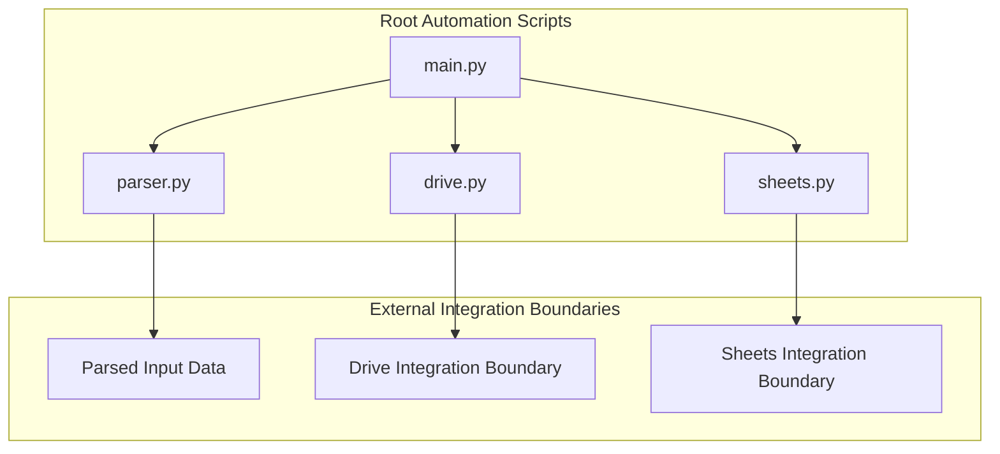
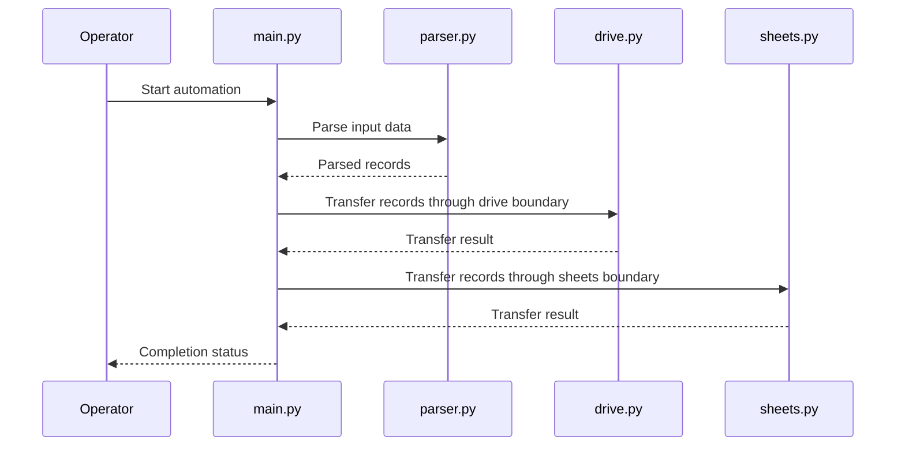
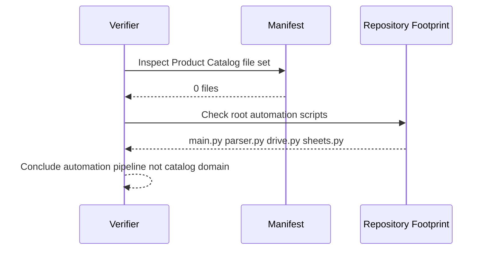

# Product Catalog Domain Feature Gap Analysis and Data Domain Verification

## Overview

This repository does not implement a Product Catalog application domain. The manifest shows **0 files** in the Product Catalog area, so there are no catalog entities, inventory views, import/export services, search endpoints, or merchandising workflows to document as owned domain features.

The only named repository entry points are the root scripts `main.py`, `parser.py`, `drive.py`, and `sheets.py`. That footprint fits a generic automation pipeline: one script coordinates execution, one parses data, and two handle transfer boundaries. From the manifest alone, the repository reads as an automation tool that can move or transform data, not as a product system with catalog-domain ownership.

## Architecture Overview

The Product Catalog domain is absent from the manifest. Any catalog-shaped data, if present at all, would be handled only at the script boundary through parser.py, drive.py, or sheets.py, not through a dedicated catalog model, service layer, or endpoint surface.

The architecture visible from the manifest is a script-driven automation flow. There is no catalog service boundary, no domain model boundary, and no UI boundary for inventory or merchandising.

## Feature Gap Analysis

| Capability | Manifest Evidence | Verification Outcome | Impact |
| --- | --- | --- | --- |
| Product catalog entities | 0 files | Not implemented | No catalog objects to own products, variants, categories, or attributes |
| Inventory views | 0 files | Not implemented | No inventory-facing read model or presentation surface |
| Import/export services | 0 files | Not implemented | No catalog-specific ingestion or export workflow |
| Search endpoints | 0 files | Not implemented | No query surface for catalog discovery |
| Merchandising workflows | 0 files | Not implemented | No promotions, ranking, curation, or merchandising state |
| Catalog persistence | 0 files | Not implemented | No repository-backed catalog storage layer |
| Catalog API surface | 0 files | Not implemented | No HTTP contract for catalog operations |
| Automation parsing boundary | Root script present | Implemented as a script boundary | Data may be transformed before transfer |
| External transfer boundary | `drive.py`, `sheets.py` present | Implemented as a script boundary | Data may be moved to or from external services |

## Component Structure

### Root Automation Scripts

The repository is organized around standalone scripts rather than domain classes. The scripts below are the only named components in the manifest and are the only plausible boundaries for any catalog-like records.

#### `main.py` Orchestration

*Path: `main.py`*

`main.py` is the top-level execution entry point. Its role in the repository is orchestration: it ties together parsing and transfer scripts rather than hosting catalog domain logic.

**Responsibilities**

- Starts the automation flow.
- Coordinates parsing and transfer steps.
- Acts as the root runtime boundary for the repository.

#### `parser.py` Data Parsing Boundary

*Path: `parser.py`*

`parser.py` is the data preparation boundary. If catalog-shaped records exist in the automation flow, they would pass through this layer first.

**Responsibilities**

- Parses input data for downstream transfer.
- Converts raw records into a normalized script-friendly form.
- Serves as the only named transformation step in the manifest.

#### `drive.py` Transfer Boundary

*Path: `drive.py`*

`drive.py` is a transfer script boundary. It represents the handoff from parsed data to an external drive-like integration.

**Responsibilities**

- Moves prepared data to the drive integration boundary.
- Encapsulates the external transfer step.
- Keeps transport concerns separated from parsing.

#### `sheets.py` Transfer Boundary

*Path: `sheets.py`*

`sheets.py` is a transfer script boundary for sheet-oriented data movement. It is the only other named integration boundary in the manifest.

**Responsibilities**

- Moves prepared data to the sheets integration boundary.
- Encapsulates sheet-oriented synchronization.
- Keeps tabular transfer concerns separate from parsing.

## Data Domain Verification

### Verified Absence of Catalog Ownership

The manifest supports the following conclusions about the data domain:

- No Product Catalog entity files are present.
- No inventory projections or inventory read models are present.
- No catalog import/export services are present.
- No search or browse endpoints are present.
- No merchandising workflows are present.
- No product-specific ownership boundary is present.

### Script-Level Data Movement Only

The repository footprint indicates that any catalog-like data would be handled as transient automation payloads:

- `parser.py` would shape incoming records.
- `drive.py` would transfer data through a drive boundary.
- `sheets.py` would transfer data through a sheets boundary.

That pattern is consistent with a generic data pipeline, not with a domain application that owns product records, merchandising rules, or inventory state.

## Feature Flows

### Automation Entry Flow

This is the only verifiable flow implied by the manifest. It is a script orchestration path, not a product catalog interaction flow.

### Catalog Domain Verification Flow

The verification outcome is based on file presence only. There is no catalog-domain implementation surface to trace into.

## State Management

### Repository-Level Data Handling

The visible repository structure supports transient, script-driven processing rather than persistent domain state.

- **Parsed data**: handled by `parser.py` before transfer.
- **Transfer payloads**: handed to `drive.py` and `sheets.py`.
- **Domain ownership**: not represented by any Product Catalog files.

No catalog state model is exposed in the manifest, so there is no catalog lifecycle to enumerate here.

## Integration Points

- `parser.py` for record shaping and normalization.
- `drive.py` for drive-bound transfer.
- `sheets.py` for sheet-bound transfer.

These are integration boundaries, not catalog features. They support automation around data movement, not product-domain ownership.

## Error Handling

No catalog-specific error contract is represented in the manifest. The only verifiable error boundary is the script orchestration layer implied by `main.py`, with downstream transfer and parsing delegated to the other root scripts.

## Dependencies

### Verified Repository Dependencies

| Dependency | Role |
| --- | --- |
| `main.py` | Automation entry point |
| `parser.py` | Input parsing boundary |
| `drive.py` | Drive transfer boundary |
| `sheets.py` | Sheets transfer boundary |

### Domain Dependency Assessment

There are no Product Catalog domain dependencies to map because the manifest contains no catalog files, models, services, or endpoints.

## Testing Considerations

The manifest supports testing around script orchestration and transfer behavior only:

- Confirm `main.py` invokes the parsing and transfer scripts in the expected order.
- Confirm `parser.py` produces the expected normalized record shape.
- Confirm `drive.py` and `sheets.py` handle transfer payloads correctly.
- Confirm no catalog ownership assumptions are introduced by the automation pipeline.

## Key Classes Reference

| Class | Responsibility |
| --- | --- |
| `main.py` | Root automation entry point and orchestration boundary |
| `parser.py` | Data parsing and normalization boundary |
| `drive.py` | Drive-oriented transfer boundary |
| `sheets.py` | Sheet-oriented transfer boundary |
