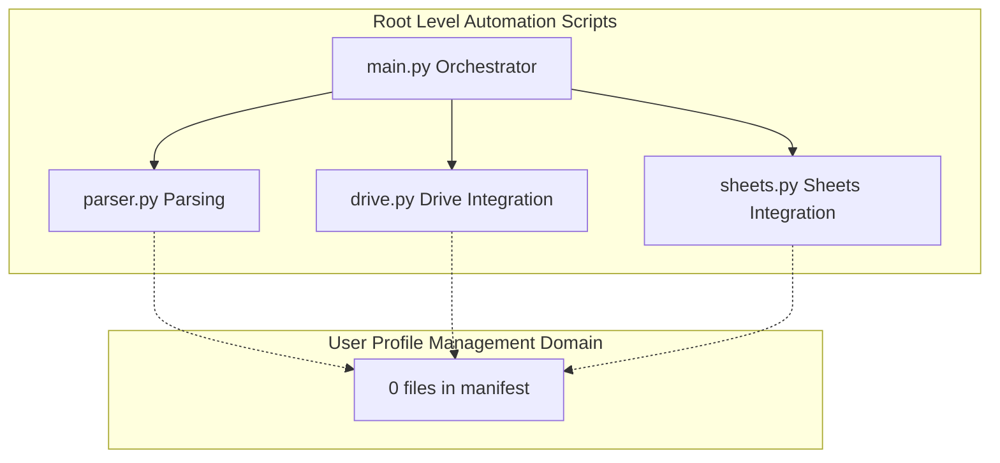

# User Profile Management Domain - Feature Gap Analysis and Confirmation of Non-Implementation

## Overview

The repository manifest assigns **0 files** to the User Profile Management domain, so there is no implemented profile feature to document as a standalone subsystem. There are no visible profile models, controllers, services, persistence modules, UI/API handlers, or domain-specific workflows tied to user accounts or profile editing.

The only root-level scripts identified in the project scope — `main.py`, `parser.py`, `drive.py`, and `sheets.py` — belong to the repository’s automation and external-service integration surface. They do not define a dedicated user-profile layer, and they do not expose profile-management responsibilities through hidden routes, services, or storage adapters.

## Architecture Overview

## Feature Gap Analysis

| Expected User Profile Management Surface | Manifest Evidence | Status |
| --- | --- | --- |
| Domain files | 0 files | Not implemented |
| Profile models | 0 files | Not implemented |
| Controllers or handlers | 0 files | Not implemented |
| Services or facades | 0 files | Not implemented |
| Storage or persistence layer | 0 files | Not implemented |
| UI or API surface | 0 files | Not implemented |
| Profile-specific state management | 0 files | Not implemented |
| Profile-specific analytics or tracking | 0 files | Not implemented |
| Profile-specific cache keys | 0 files | Not implemented |

## Confirmed Non-Implementation

The documented scope for User Profile Management is empty in the manifest. Any user-related values that may appear elsewhere in parsed data or spreadsheet rows would belong to general automation payloads, not to a dedicated profile-management implementation.

- `main.py` does not introduce a user-profile workflow, profile bootstrap path, or profile-specific orchestration branch.
- `parser.py` does not define profile parsing, profile schema translation, or profile validation logic.
- `drive.py` does not provide profile storage, profile lookup, or account-management behavior.
- `sheets.py` does not expose profile CRUD, user identity management, or profile synchronization responsibilities.

## Root Script Boundaries

### `main.py`

*File path: `main.py`*

`main.py` is part of the repository’s top-level execution path, but it is not associated with a profile-management domain. In the current manifest, it functions as an application entry point rather than a user account feature boundary.

| Observed Role | Profile-Management Impact |
| --- | --- |
| Root orchestration script | No profile domain responsibilities are defined |

### `parser.py`

*File path: `parser.py`*

`parser.py` belongs to the data-ingestion side of the project. Its presence supports input parsing for the automation workflow, not user profile modeling or profile persistence.

| Observed Role | Profile-Management Impact |
| --- | --- |
| Parsing and transformation boundary | No profile schema, controller, or service surface |

### `drive.py`

*File path: `drive.py`*

`drive.py` is the external integration boundary for Drive-related operations. In the manifest scope, it supports automation data movement rather than a user-profile storage subsystem.

| Observed Role | Profile-Management Impact |
| --- | --- |
| External Drive integration | No profile storage or profile API surface |

### `sheets.py`

*File path: `sheets.py`*

`sheets.py` is the spreadsheet integration boundary. It supports tabular data exchange for the automation workflow, but it does not define profile-management behavior in the manifest.

| Observed Role | Profile-Management Impact |
| --- | --- |
| External Sheets integration | No profile CRUD, synchronization, or account logic |

## API Integration

No HTTP endpoints are associated with User Profile Management in the manifest scope. There are no profile-specific routes, request models, response models, or middleware chains to document for this domain.

## Data Models

No user-profile request or response models are present in the documented domain scope.

## Feature Flows

No user-profile user journey, profile-editing flow, or account-management sequence is implemented in the manifest scope.

## State Management

No user-profile state machine, lifecycle enum, or domain-specific transition model is defined in the documented scope.

## Integration Points

The only visible integration boundaries in the root-level script set are the repository’s general automation connections to parsing, Drive, and Sheets. Those integrations do not form a user-profile subsystem.

## Error Handling

No profile-management error handling path is defined in the manifest scope.

## Caching Strategy

No profile-specific cache keys, cache invalidation rules, or cache-backed profile lookups are implemented in the documented scope.

## Dependencies

The documented scope only shows root-level automation scripts and their service-integration boundaries. No profile-domain dependency graph is present in the manifest.

## Testing Considerations

For this domain, the only meaningful verification is structural:

- confirm the manifest remains at 0 files for User Profile Management
- confirm no profile-specific classes or methods are introduced into `main.py`, `parser.py`, `drive.py`, or `sheets.py`
- confirm no profile endpoints, storage adapters, or UI/API handlers appear in the repository scope

## Key Classes Reference

| Class | Responsibility |
| --- | --- |
| `main.py` | Root orchestration entry point; no user-profile responsibility |
| `parser.py` | Input parsing boundary; no user-profile responsibility |
| `drive.py` | Drive integration boundary; no user-profile responsibility |
| `sheets.py` | Sheets integration boundary; no user-profile responsibility |
